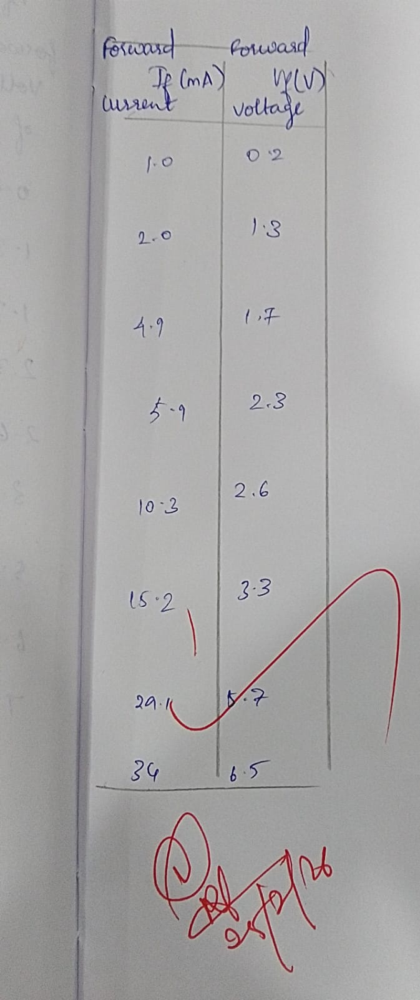
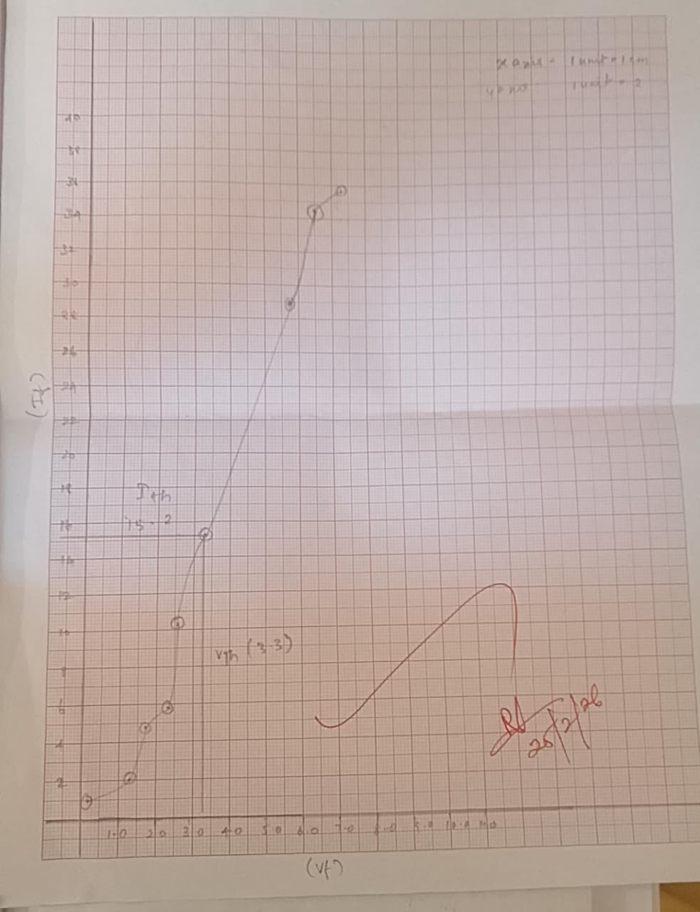

# Voltage---Current-Characteristics-of-LED/LASER
# Fiber Optic LED and Photo Detector Characteristics

## AIM
- To study the IV characteristics of fiber optic LED and plot the graph of forward current vs. output optical energy.  
- To study the photo detector response.

---

## THEORY
In an optical fiber communication system, the electrical signal is first converted into an optical signal using an **E/O conversion device** such as an LED. The optical signal is transmitted through the fiber and then retrieved in its original electrical form using an **O/E conversion device** such as a photo detector.

Key points:
- **LEDs**:  
  - Emitters vary due to chip fabrication technologies.  
  - Important parameters: peak wavelength, conversion efficiency, optical rise/fall times, max forward current, forward voltage.  
  - Linear optical output with respect to forward current in a certain region.  

- **Photodetectors**:  
  - Types: photoconductive, photovoltaic, transistor-type, diode-type.  
  - Important parameters: response time, wavelength sensitivity, responsivity.  

- **Numerical Aperture (NA)**:  
  - Defines the acceptance cone of the fiber.  
  - Light must enter within this cone to be transmitted properly; otherwise, it refracts out of the core.  

---
## Circuit diagram

---
## TABULATION

## MODEL GRAPH

## RESULT
- The IV characteristics of the fiber optic LED were studied.  

